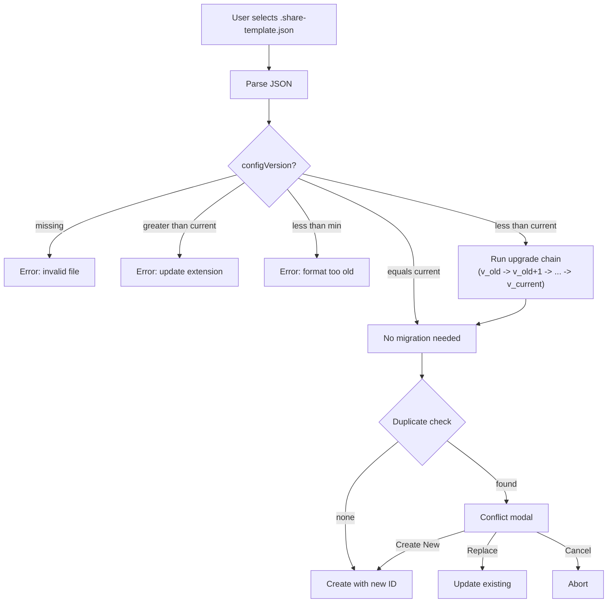
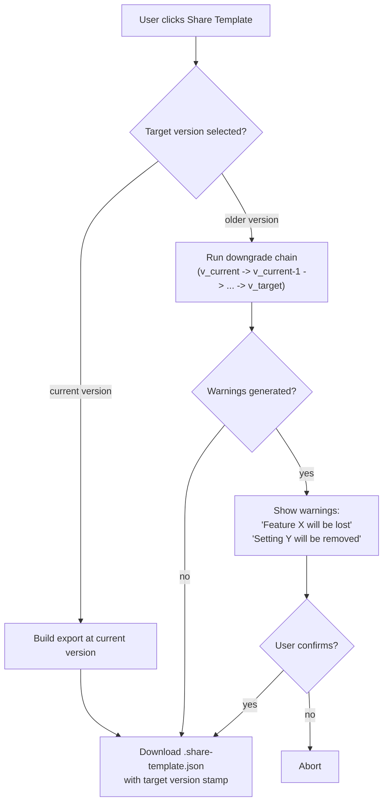
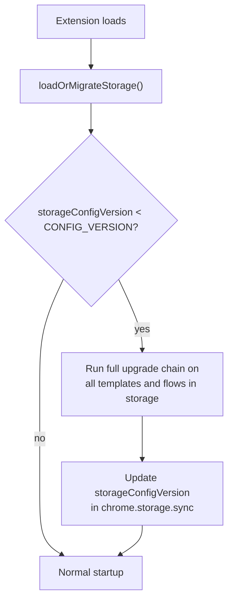

# Migration Dashboard and Version Chains

Phase 2 of the Export/Import Share Feature. To be built when `CONFIG_VERSION` is first bumped to 2.

---

## 1. Migration Registry: `src/config-migrations.js`

New file containing all version migration logic.

### Structure

```javascript
const CONFIG_MIGRATIONS = {
  "1_to_2": {
    upgrade(config) {
      // Add new properties with defaults
      // e.g., config.fieldConfigs.forEach(f => f.retryCount = f.retryCount ?? 0);
      return config;
    },
    downgrade(config) {
      // Remove properties not understood by v1
      // Return { config, warnings: ["retryCount settings will be lost"] }
      return { config, warnings: [] };
    },
  },
  "2_to_3": {
    upgrade(config) { /* ... */ return config; },
    downgrade(config) { /* ... */ return { config, warnings: [] }; },
  },
};
```

Each migration key is `"N_to_N+1"` and has exactly two functions:

- `upgrade(config)` — transforms config from vN to vN+1. Always lossless.
- `downgrade(config)` — transforms config from vN+1 to vN. May lose features; returns warnings.

### Chain Runner Functions

- `upgradeConfig(config, fromVersion, toVersion)`:
  - Runs `upgrade` functions sequentially: fromVersion -> fromVersion+1 -> ... -> toVersion
  - e.g., v1 to v4: runs `1_to_2.upgrade`, then `2_to_3.upgrade`, then `3_to_4.upgrade`
  - Returns upgraded config
- `downgradeConfig(config, fromVersion, toVersion)`:
  - Runs `downgrade` functions in reverse: fromVersion -> fromVersion-1 -> ... -> toVersion
  - e.g., v4 to v1: runs `3_to_4.downgrade`, then `2_to_3.downgrade`, then `1_to_2.downgrade`
  - Accumulates warnings from each step
  - Returns `{ config, warnings }` so UI can display what was lost

### Supported Version Range

```javascript
const CONFIG_VERSION = 4;
const MIN_EXPORT_VERSION = 1;  // no bounding initially; export to any old version
const MIN_IMPORT_VERSION = 1;  // no bounding initially; import from any old version
```

Initially no bounding. If we later decide to bound, we just change `MIN_EXPORT_VERSION` / `MIN_IMPORT_VERSION`.

---

## 2. Update Import Logic in `src/export-import.js`

`parseShareImport` evolves to run the upgrade chain:

```javascript
function parseShareImport(jsonString) {
  const parsed = JSON.parse(jsonString);
  const fileVersion = parsed.configVersion;

  if (!fileVersion || typeof fileVersion !== "number") {
    throw new Error("Invalid export file: missing configVersion");
  }
  if (fileVersion > CONFIG_VERSION) {
    throw new Error(
      `This file is config version ${fileVersion}, but your extension ` +
      `only supports up to version ${CONFIG_VERSION}. Please update the extension.`
    );
  }
  if (fileVersion < MIN_IMPORT_VERSION) {
    throw new Error(
      `This file is config version ${fileVersion}, which is no longer supported. ` +
      `Minimum supported: version ${MIN_IMPORT_VERSION}.`
    );
  }

  // Auto-upgrade if older
  if (fileVersion < CONFIG_VERSION) {
    parsed = upgradeConfig(parsed, fileVersion, CONFIG_VERSION);
    parsed.configVersion = CONFIG_VERSION;
  }

  return parsed;
}
```

---

## 3. Update Export Logic for Version Selection

`buildTemplateShareExport` and `buildFlowShareExport` accept an optional `targetVersion` parameter:

```javascript
function buildTemplateShareExport(template, targetVersion = CONFIG_VERSION) {
  let exportData = { /* ... build at current version ... */ };

  if (targetVersion < CONFIG_VERSION) {
    const { config, warnings } = downgradeConfig(exportData, CONFIG_VERSION, targetVersion);
    exportData = config;
    exportData.configVersion = targetVersion;
    return { exportData, warnings }; // caller shows warnings to user
  }

  exportData.configVersion = CONFIG_VERSION;
  return { exportData, warnings: [] };
}
```

---

## 4. Storage Auto-Migration on Extension Update

In `src/storage-defaults.js`, update `loadOrMigrateStorage()`:

```javascript
async function loadOrMigrateStorage() {
  const data = await chrome.storage.sync.get(null);

  // Check stored config version
  const storedVersion = data.storageConfigVersion || 1;

  if (storedVersion < CONFIG_VERSION) {
    // Run full upgrade chain on all templates and flows in storage
    if (data.templates) {
      data.templates = data.templates.map(tpl => {
        tpl.fieldConfigs = upgradeFieldConfigs(tpl.fieldConfigs, storedVersion, CONFIG_VERSION);
        return tpl;
      });
    }
    if (data.flows) {
      data.flows = data.flows.map(flow => {
        return upgradeFlowConfig(flow, storedVersion, CONFIG_VERSION);
      });
    }
    data.storageConfigVersion = CONFIG_VERSION;
    await chrome.storage.sync.set(data);
  }

  // ... existing default-filling logic ...
}
```

This runs the full chain (not bounded) because we can't control when a user updates. No user prompt — it's automatic and silent since upgrades are always lossless.

---

## 5. Migration Dashboard UI

New section in `src/options.html`, added to the options page (likely in a new tab or collapsible section in the actions panel).

### Dashboard Elements

- **Current Config Version** display: "Your extension uses config version N"
- **Export Version Picker**: dropdown (v1, v2, ... vN) integrated into the Share Template / Share Flow buttons
  - When a version < current is selected, show warnings about feature loss before downloading
- **Import Preview**: when importing, if version mismatch detected, show a summary:
  - "This file uses config version X. It will be upgraded to version Y."
  - List of changes that will be applied
  - [Proceed] / [Cancel]

### Wireframe

```
+------------------------------------------+
| Share Template                           |
| +--------------------------------------+ |
| | Export as version:  [v3 (current) v]  | |
| |                                       | |
| | [Share Template]                      | |
| +--------------------------------------+ |
|                                          |
| Import Template                          |
| +--------------------------------------+ |
| | [Choose File...]                      | |
| |                                       | |
| | (after file selected):               | |
| | File version: v1                      | |
| | Will upgrade: v1 -> v2 -> v3          | |
| | Changes applied:                      | |
| |  - Added retryCount (default: 0)     | |
| |  - Added dialogType (default: alert)  | |
| |                                       | |
| | [Import] [Cancel]                     | |
| +--------------------------------------+ |
+------------------------------------------+
```

---

## 6. Migration Flow Diagrams

### Import with auto-upgrade



### Export with optional downgrade



### Storage auto-migration on extension update



---

## 7. Migration Guidelines

A developer reference doc (`src/MIGRATION_GUIDELINES.md`) to be created alongside Phase 2, explaining:

- When to bump `CONFIG_VERSION`
- How to write a new migration pair (`upgrade` + `downgrade`)
- What constitutes a config shape change vs. a code-only change
- Testing checklist for migrations
- How downgrade warnings should be worded
